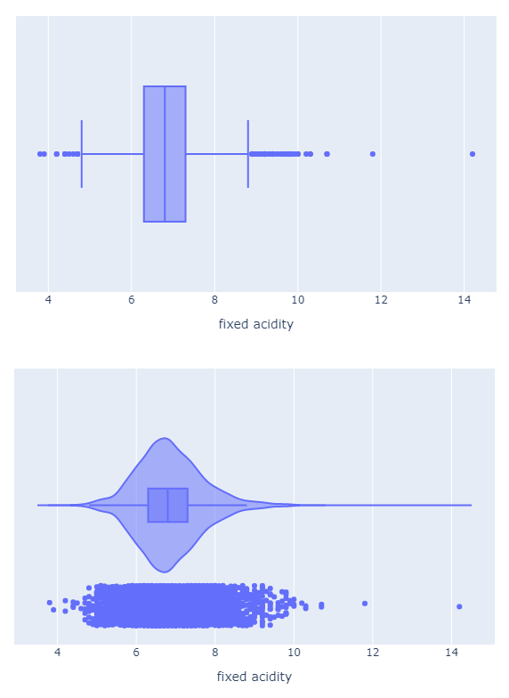

- WHAT?  
What is the exploratory data analysis? According to the [Wikipedia](https://en.wikipedia.org/wiki/Exploratory_data_analysis), Exploratory Data Analysis (EDA) is an approach     to analyzing data sets to summarize their main characteristics, often with visual methods. A statistical model can be used or not, but primarily EDA is for seeing what the       data can tell us beyond the formal modeling or hypothesis testing task. 

- WHY?  
EDA helps identify errors (missing values), understand patterns within the data, detect outliers or anomalous events, and find interesting relations among the variables.        Before the machine models are built, EDA help determine which models could be used, patterns of each variables, see the descriptive statistics, and define the problems that     can be answered from the dataset. 

- HOW?   
The EDA can be performed by visualizating the dataset (scatter plot, histogram, correlation matrix and more) and by showing summary statistics. In this article, I will explore this [dataset](https://archive.ics.uci.edu/ml/datasets/Wine+Quality) by seeing if there is missing values, outliers and summary statistics for each variable.

Here are some packages that will be using for EDA. Numpy and Pandas for data processing ; Ploty, Matplotlib, and Seaborn for data visualization ; statsmodels for conducting statistical tests, and statistical data exploration.
```python
import numpy as np
import pandas as pd
import plotly.graph_objects as go
from plotly import express as px
import matplotlib.pyplot as plt
import seaborn as sns
import statsmodels.api
```

Next step is to load the data. The raw data can be downloaded through [UC Irvine Machine Learning Repository](https://archive.ics.uci.edu/ml/index.php). I downloaded and saved it in my Github. By using [pd.read_csv](https://pandas.pydata.org/pandas-docs/stable/reference/api/pandas.read_csv.html), we can read the csv format dataset. Please note that I used 'sep' parameter since each variable is separated by ';'. The default for 'sep' parameter is ',' so if the variables is separated by ';', this parameter can be ignored. After successfully loaded the dataset, [pandas.DataFrame.head](https://pandas.pydata.org/pandas-docs/stable/reference/api/pandas.DataFrame.head.html) function can return the first n rows of the dataset.
```python
data = pd.read_csv('https://raw.githubusercontent.com/alex31425/MTHuang/master/data/winequality-white.csv',sep = ';')
data.head()
```


<div>

<table border="1" class="dataframe">
  <thead>
    <tr style="text-align: right;">
      <th></th>
      <th>fixed acidity</th>
      <th>volatile acidity</th>
      <th>citric acid</th>
      <th>residual sugar</th>
      <th>chlorides</th>
      <th>free sulfur dioxide</th>
      <th>total sulfur dioxide</th>
      <th>density</th>
      <th>pH</th>
      <th>sulphates</th>
      <th>alcohol</th>
      <th>quality</th>
    </tr>
  </thead>
  <tbody>
    <tr>
      <th>0</th>
      <td>7.0</td>
      <td>0.27</td>
      <td>0.36</td>
      <td>20.7</td>
      <td>0.045</td>
      <td>45.0</td>
      <td>170.0</td>
      <td>1.0010</td>
      <td>3.00</td>
      <td>0.45</td>
      <td>8.8</td>
      <td>6</td>
    </tr>
    <tr>
      <th>1</th>
      <td>6.3</td>
      <td>0.30</td>
      <td>0.34</td>
      <td>1.6</td>
      <td>0.049</td>
      <td>14.0</td>
      <td>132.0</td>
      <td>0.9940</td>
      <td>3.30</td>
      <td>0.49</td>
      <td>9.5</td>
      <td>6</td>
    </tr>
    <tr>
      <th>2</th>
      <td>8.1</td>
      <td>0.28</td>
      <td>0.40</td>
      <td>6.9</td>
      <td>0.050</td>
      <td>30.0</td>
      <td>97.0</td>
      <td>0.9951</td>
      <td>3.26</td>
      <td>0.44</td>
      <td>10.1</td>
      <td>6</td>
    </tr>
    <tr>
      <th>3</th>
      <td>7.2</td>
      <td>0.23</td>
      <td>0.32</td>
      <td>8.5</td>
      <td>0.058</td>
      <td>47.0</td>
      <td>186.0</td>
      <td>0.9956</td>
      <td>3.19</td>
      <td>0.40</td>
      <td>9.9</td>
      <td>6</td>
    </tr>
    <tr>
      <th>4</th>
      <td>7.2</td>
      <td>0.23</td>
      <td>0.32</td>
      <td>8.5</td>
      <td>0.058</td>
      <td>47.0</td>
      <td>186.0</td>
      <td>0.9956</td>
      <td>3.19</td>
      <td>0.40</td>
      <td>9.9</td>
      <td>6</td>
    </tr>
  </tbody>
</table>
</div>

Here I used [pandas.DataFrame.dtypes](https://pandas.pydata.org/pandas-docs/stable/reference/api/pandas.DataFrame.dtypes.html) to check the data type for each column, [pandas.DataFrame.shape](https://pandas.pydata.org/pandas-docs/stable/reference/api/pandas.DataFrame.shape.html) to see how many rows and cloumns of this dataset, and [pandas.isnull](https://pandas.pydata.org/pandas-docs/stable/reference/api/pandas.isnull.html) to see if there is any column has missing values. In addition, we can also use [pandas.DataFrame.count](https://pandas.pydata.org/pandas-docs/stable/reference/api/pandas.DataFrame.count.html) to count non-NA cells for each column or row. Combined with pandas.DataFrame.shape, we can count how many missing values for each column.  

```python
data.shape
```


    (4898, 12)
    
    

```python
print("The dataset contains following number of records for each of the columns : \n" +str(data.count()))
```

    The dataset contains following number of records for each of the columns : 
    fixed acidity           4898
    volatile acidity        4898
    citric acid             4898
    residual sugar          4898
    chlorides               4898
    free sulfur dioxide     4898
    total sulfur dioxide    4898
    density                 4898
    pH                      4898
    sulphates               4898
    alcohol                 4898
    quality                 4898
    dtype: int64
    
    
```python
print("The dataset contains columns of the following data types : \n" +str(data.dtypes))
```

    The dataset contains columns of the following data types : 
    fixed acidity           float64
    volatile acidity        float64
    citric acid             float64
    residual sugar          float64
    chlorides               float64
    free sulfur dioxide     float64
    total sulfur dioxide    float64
    density                 float64
    pH                      float64
    sulphates               float64
    alcohol                 float64
    quality                   int64
    dtype: object    
    
    
```python
data.isnull().sum()
```


    fixed acidity           0
    volatile acidity        0
    citric acid             0
    residual sugar          0
    chlorides               0
    free sulfur dioxide     0
    total sulfur dioxide    0
    density                 0
    pH                      0
    sulphates               0
    alcohol                 0
    quality                 0
    dtype: int64

Pandas has a more powerful function for checking missing values, columns, and data type which is [pandas.DataFrame.info](https://pandas.pydata.org/pandas-docs/stable/reference/api/pandas.DataFrame.info.html#pandas-dataframe-info). 
```python
data.info()
```

    <class 'pandas.core.frame.DataFrame'>
    RangeIndex: 4898 entries, 0 to 4897
    Data columns (total 12 columns):
     #   Column                Non-Null Count  Dtype  
    ---  ------                --------------  -----  
     0   fixed acidity         4898 non-null   float64
     1   volatile acidity      4898 non-null   float64
     2   citric acid           4898 non-null   float64
     3   residual sugar        4898 non-null   float64
     4   chlorides             4898 non-null   float64
     5   free sulfur dioxide   4898 non-null   float64
     6   total sulfur dioxide  4898 non-null   float64
     7   density               4898 non-null   float64
     8   pH                    4898 non-null   float64
     9   sulphates             4898 non-null   float64
     10  alcohol               4898 non-null   float64
     11  quality               4898 non-null   int64  
    dtypes: float64(11), int64(1)
    memory usage: 459.3 KB
    
[pandas.DataFrame.describe](https://pandas.pydata.org/pandas-docs/stable/reference/api/pandas.DataFrame.describe.html) will generate descriptive statistics for this dataset. 

```python
data.describe()
```


<table border="1" class="dataframe">
  <thead>
    <tr style="text-align: right;">
      <th></th>
      <th>fixed acidity</th>
      <th>volatile acidity</th>
      <th>citric acid</th>
      <th>residual sugar</th>
      <th>chlorides</th>
      <th>free sulfur dioxide</th>
      <th>total sulfur dioxide</th>
      <th>density</th>
      <th>pH</th>
      <th>sulphates</th>
      <th>alcohol</th>
      <th>quality</th>
    </tr>
  </thead>
  <tbody>
    <tr>
      <th>count</th>
      <td>4898.000000</td>
      <td>4898.000000</td>
      <td>4898.000000</td>
      <td>4898.000000</td>
      <td>4898.000000</td>
      <td>4898.000000</td>
      <td>4898.000000</td>
      <td>4898.000000</td>
      <td>4898.000000</td>
      <td>4898.000000</td>
      <td>4898.000000</td>
      <td>4898.000000</td>
    </tr>
    <tr>
      <th>mean</th>
      <td>6.854788</td>
      <td>0.278241</td>
      <td>0.334192</td>
      <td>6.391415</td>
      <td>0.045772</td>
      <td>35.308085</td>
      <td>138.360657</td>
      <td>0.994027</td>
      <td>3.188267</td>
      <td>0.489847</td>
      <td>10.514267</td>
      <td>5.877909</td>
    </tr>
    <tr>
      <th>std</th>
      <td>0.843868</td>
      <td>0.100795</td>
      <td>0.121020</td>
      <td>5.072058</td>
      <td>0.021848</td>
      <td>17.007137</td>
      <td>42.498065</td>
      <td>0.002991</td>
      <td>0.151001</td>
      <td>0.114126</td>
      <td>1.230621</td>
      <td>0.885639</td>
    </tr>
    <tr>
      <th>min</th>
      <td>3.800000</td>
      <td>0.080000</td>
      <td>0.000000</td>
      <td>0.600000</td>
      <td>0.009000</td>
      <td>2.000000</td>
      <td>9.000000</td>
      <td>0.987110</td>
      <td>2.720000</td>
      <td>0.220000</td>
      <td>8.000000</td>
      <td>3.000000</td>
    </tr>
    <tr>
      <th>25%</th>
      <td>6.300000</td>
      <td>0.210000</td>
      <td>0.270000</td>
      <td>1.700000</td>
      <td>0.036000</td>
      <td>23.000000</td>
      <td>108.000000</td>
      <td>0.991723</td>
      <td>3.090000</td>
      <td>0.410000</td>
      <td>9.500000</td>
      <td>5.000000</td>
    </tr>
    <tr>
      <th>50%</th>
      <td>6.800000</td>
      <td>0.260000</td>
      <td>0.320000</td>
      <td>5.200000</td>
      <td>0.043000</td>
      <td>34.000000</td>
      <td>134.000000</td>
      <td>0.993740</td>
      <td>3.180000</td>
      <td>0.470000</td>
      <td>10.400000</td>
      <td>6.000000</td>
    </tr>
    <tr>
      <th>75%</th>
      <td>7.300000</td>
      <td>0.320000</td>
      <td>0.390000</td>
      <td>9.900000</td>
      <td>0.050000</td>
      <td>46.000000</td>
      <td>167.000000</td>
      <td>0.996100</td>
      <td>3.280000</td>
      <td>0.550000</td>
      <td>11.400000</td>
      <td>6.000000</td>
    </tr>
    <tr>
      <th>max</th>
      <td>14.200000</td>
      <td>1.100000</td>
      <td>1.660000</td>
      <td>65.800000</td>
      <td>0.346000</td>
      <td>289.000000</td>
      <td>440.000000</td>
      <td>1.038980</td>
      <td>3.820000</td>
      <td>1.080000</td>
      <td>14.200000</td>
      <td>9.000000</td>
    </tr>
  </tbody>
</table>
    

    
    
  ```python

for column in data:
    fig = px.box(data[column],x = column)
    figv = px.violin(data, x = column, box=True, # draw box plot inside the violin
                points='all', # can be 'outliers', or False
               )
    figv.show()
    fig.show()

```  

[](https://raw.githubusercontent.com/alex31425/MTHuang/master/images/EDAplot-boxviolin.png){:target="_blank"} 
    


```python
sns.heatmap(data.isnull(), cbar=False)
```


```python
for c in data.columns[:-2]:
    data.boxplot(column=c, by=['quality'],figsize = (10,5) )
    plt.title(c)
    plt.suptitle("")
    plt.xlabel('xlabel')
    plt.ylabel('ylabel')
```


```python
print( "Each category within the quality column has the following count : ")
print(data.groupby(['quality']).size())
index = data['quality'].unique()
quality_plot = data['quality'].value_counts(sort=True, ascending=False).plot(kind='bar',figsize=(5,5),title="Total number for occurences of quality " + str(data['quality'].count()))
quality_plot.set_xlabel("Quality")
quality_plot.set_ylabel("Frequency")
```

    Each category within the quality column has the following count : 
    quality
    3      20
    4     163
    5    1457
    6    2198
    7     880
    8     175
    9       5
    dtype: int64
    
      
    
```python
X = data.iloc[:, :-1].to_numpy()
y = data.iloc[:, -1].to_numpy()
f = list(data.columns)
f.remove('quality')
len(X),y,f
```


    (4898,
     array([6, 6, 6, ..., 6, 7, 6], dtype=int64),
     ['fixed acidity',
      'volatile acidity',
      'citric acid',
      'residual sugar',
      'chlorides',
      'free sulfur dioxide',
      'total sulfur dioxide',
      'density',
      'pH',
      'sulphates',
      'alcohol'])
      
    
      
```python
linear_regression_model = statsmodels.api.OLS(y,X)
linear_regression_model_fitted = linear_regression_model.fit()

print(linear_regression_model_fitted.summary(), '\n')
```

                                     OLS Regression Results                                
    =======================================================================================
    Dep. Variable:                      y   R-squared (uncentered):                   0.984
    Model:                            OLS   Adj. R-squared (uncentered):              0.984
    Method:                 Least Squares   F-statistic:                          2.707e+04
    Date:                Sat, 06 Feb 2021   Prob (F-statistic):                        0.00
    Time:                        00:09:39   Log-Likelihood:                         -5575.5
    No. Observations:                4898   AIC:                                  1.117e+04
    Df Residuals:                    4887   BIC:                                  1.124e+04
    Df Model:                          11                                                  
    Covariance Type:            nonrobust                                                  
    ==============================================================================
                     coef    std err          t      P>|t|      [0.025      0.975]
    ------------------------------------------------------------------------------
    x1            -0.0506      0.015     -3.356      0.001      -0.080      -0.021
    x2            -1.9585      0.114    -17.196      0.000      -2.182      -1.735
    x3            -0.0293      0.096     -0.305      0.760      -0.218       0.159
    x4             0.0250      0.003      9.642      0.000       0.020       0.030
    x5            -0.9426      0.543     -1.736      0.083      -2.007       0.122
    x6             0.0048      0.001      5.710      0.000       0.003       0.006
    x7            -0.0009      0.000     -2.352      0.019      -0.002      -0.000
    x8             2.0420      0.353      5.780      0.000       1.349       2.735
    x9             0.1684      0.084      2.014      0.044       0.005       0.332
    x10            0.4165      0.097      4.279      0.000       0.226       0.607
    x11            0.3656      0.011     32.880      0.000       0.344       0.387
    ==============================================================================
    Omnibus:                      108.883   Durbin-Watson:                   1.624
    Prob(Omnibus):                  0.000   Jarque-Bera (JB):              236.495
    Skew:                           0.064   Prob(JB):                     4.42e-52
    Kurtosis:                       4.069   Cond. No.                     7.71e+03
    ==============================================================================
    
    Notes:
    [1] R² is computed without centering (uncentered) since the model does not contain a constant.
    [2] Standard Errors assume that the covariance matrix of the errors is correctly specified.
    [3] The condition number is large, 7.71e+03. This might indicate that there are
    strong multicollinearity or other numerical problems. 
    

    
```python
# Determine if the predictor continuous or boolean &
# create plots for each variable type
predictor_type = []
t_score = []

con_array = np.array([])
cat_array = np.array([])
for idx, column in enumerate(X.T):

    feature_name = f[idx]
    predictor = statsmodels.api.add_constant(column)

    # Get the stats & plot

    if np.unique(X.T[idx]).size < 5:
        v_type = "boolean"
        cat_array = np.append(cat_array, column)
        print(f[idx], "is boolean" )
        if response_type == "continuous":

            logistic_regression_model = statsmodels.api.GLM(y, predictor)
            logistic_regression_model_fitted = (
                logistic_regression_model.fit()
            )  # noqa
            print(f"Variable: {feature_name}")
            print(logistic_regression_model_fitted.summary(), '\n')
            t_value = round(logistic_regression_model_fitted.tvalues[1], 6)
            p_value = "{:.6e}".format(
                logistic_regression_model_fitted.pvalues[1]
            )  # noqa

            # Categorical Predictor by Continuous Response

            fig = px.histogram(x=column, y=y, histfunc="count")
            fig.update_layout(
                title=f"Variable: {feature_name}: (t-value={t_value}) (p-value={p_value})",  # noqa
                xaxis_title=f"Variable: {feature_name}",
                yaxis_title="Response",
            )

            fig.show()
 

        else:

            logistic_regression_model = statsmodels.api.GLM(y, predictor)
            logistic_regression_model_fitted = (
                logistic_regression_model.fit()
            )  # noqa
            print(f"Variable: {feature_name}")
            print(logistic_regression_model_fitted.summary(), '\n')
            t_value = round(logistic_regression_model_fitted.tvalues[1], 6)
            p_value = "{:.6e}".format(
                logistic_regression_model_fitted.pvalues[1]
            )  # noqa

            # Categorical Predictor by Continuous Response

            fig = px.scatter(x=column, y=y)
            fig.update_layout(
                title=f"Variable: {feature_name}: (t-value={t_value}) (p-value={p_value})",  # noqa
                xaxis_title=f"Variable: {feature_name}",
                yaxis_title="y",
            )

            fig.show()
  
            
    else:
        print(f[idx], "is continuous")
        v_type = "continuous"
        con_array = np.append(cat_array, column)  # noqa
        if response_type == "continuous":

            linear_regression_model = statsmodels.api.OLS(y, predictor)
            linear_regression_model_fitted = linear_regression_model.fit()
            print(f"Variable: {feature_name}")
            print(linear_regression_model_fitted.summary(), '\n')
            t_value = round(linear_regression_model_fitted.tvalues[1], 6)
            p_value = "{:.6e}".format(
                linear_regression_model_fitted.pvalues[1]
            )  # noqa

            # Continuous Predictor by Continuous Response
            # Plot the figure
            fig = px.scatter(x=column, y=y)
            fig.update_layout(
                title=f"Variable: {feature_name}: (t-value={t_value}) (p-value={p_value})",  # noqa
                xaxis_title=f"Variable: {feature_name}",
                yaxis_title="y",
            )

            fig.show()

            
        else:
            linear_regression_model = statsmodels.api.OLS(y, predictor)
            linear_regression_model_fitted = linear_regression_model.fit()
            print(f"Variable: {feature_name}")
            print(linear_regression_model_fitted.summary(), '\n')
            t_value = round(linear_regression_model_fitted.tvalues[1], 6)
            p_value = "{:.6e}".format(
                linear_regression_model_fitted.pvalues[1]
            )  # noqa
            # Continuous Predictor by Categorical Response
            # Plot the figure
            fig = px.histogram(x=column, y=y)
            fig.update_layout(
                title=f"Variable: {feature_name}: (t-value={t_value}) (p-value={p_value})",  # noqa
                xaxis_title=f"Variable: {feature_name}",
                yaxis_title="y",
            )

            fig.show()
    
    # create a list of each variable type
    predictor_type.append(v_type)
    t_score.append(t_value)


```


    fixed acidity is continuous
    Variable: fixed acidity
                                OLS Regression Results                            
    ==============================================================================
    Dep. Variable:                      y   R-squared:                       0.013
    Model:                            OLS   Adj. R-squared:                  0.013
    Method:                 Least Squares   F-statistic:                     64.08
    Date:                Fri, 12 Feb 2021   Prob (F-statistic):           1.48e-15
    Time:                        18:40:26   Log-Likelihood:                -6322.8
    No. Observations:                4898   AIC:                         1.265e+04
    Df Residuals:                    4896   BIC:                         1.266e+04
    Df Model:                           1                                         
    Covariance Type:            nonrobust                                         
    ==============================================================================
                     coef    std err          t      P>|t|      [0.025      0.975]
    ------------------------------------------------------------------------------
    const          6.6956      0.103     65.057      0.000       6.494       6.897
    x1            -0.1193      0.015     -8.005      0.000      -0.149      -0.090
    ==============================================================================
    Omnibus:                       29.986   Durbin-Watson:                   1.657
    Prob(Omnibus):                  0.000   Jarque-Bera (JB):               31.513
    Skew:                           0.166   Prob(JB):                     1.44e-07
    Kurtosis:                       3.211   Cond. No.                         57.7
    ==============================================================================
    
    Notes:
    [1] Standard Errors assume that the covariance matrix of the errors is correctly specified. 
    


```python
data.corr()
```


<table border="1" class="dataframe">
  <thead>
    <tr style="text-align: right;">
      <th></th>
      <th>fixed acidity</th>
      <th>volatile acidity</th>
      <th>citric acid</th>
      <th>residual sugar</th>
      <th>chlorides</th>
      <th>free sulfur dioxide</th>
      <th>total sulfur dioxide</th>
      <th>density</th>
      <th>pH</th>
      <th>sulphates</th>
      <th>alcohol</th>
      <th>quality</th>
    </tr>
  </thead>
  <tbody>
    <tr>
      <th>fixed acidity</th>
      <td>1.000000</td>
      <td>-0.022697</td>
      <td>0.289181</td>
      <td>0.089021</td>
      <td>0.023086</td>
      <td>-0.049396</td>
      <td>0.091070</td>
      <td>0.265331</td>
      <td>-0.425858</td>
      <td>-0.017143</td>
      <td>-0.120881</td>
      <td>-0.113663</td>
    </tr>
    <tr>
      <th>volatile acidity</th>
      <td>-0.022697</td>
      <td>1.000000</td>
      <td>-0.149472</td>
      <td>0.064286</td>
      <td>0.070512</td>
      <td>-0.097012</td>
      <td>0.089261</td>
      <td>0.027114</td>
      <td>-0.031915</td>
      <td>-0.035728</td>
      <td>0.067718</td>
      <td>-0.194723</td>
    </tr>
    <tr>
      <th>citric acid</th>
      <td>0.289181</td>
      <td>-0.149472</td>
      <td>1.000000</td>
      <td>0.094212</td>
      <td>0.114364</td>
      <td>0.094077</td>
      <td>0.121131</td>
      <td>0.149503</td>
      <td>-0.163748</td>
      <td>0.062331</td>
      <td>-0.075729</td>
      <td>-0.009209</td>
    </tr>
    <tr>
      <th>residual sugar</th>
      <td>0.089021</td>
      <td>0.064286</td>
      <td>0.094212</td>
      <td>1.000000</td>
      <td>0.088685</td>
      <td>0.299098</td>
      <td>0.401439</td>
      <td>0.838966</td>
      <td>-0.194133</td>
      <td>-0.026664</td>
      <td>-0.450631</td>
      <td>-0.097577</td>
    </tr>
    <tr>
      <th>chlorides</th>
      <td>0.023086</td>
      <td>0.070512</td>
      <td>0.114364</td>
      <td>0.088685</td>
      <td>1.000000</td>
      <td>0.101392</td>
      <td>0.198910</td>
      <td>0.257211</td>
      <td>-0.090439</td>
      <td>0.016763</td>
      <td>-0.360189</td>
      <td>-0.209934</td>
    </tr>
    <tr>
      <th>free sulfur dioxide</th>
      <td>-0.049396</td>
      <td>-0.097012</td>
      <td>0.094077</td>
      <td>0.299098</td>
      <td>0.101392</td>
      <td>1.000000</td>
      <td>0.615501</td>
      <td>0.294210</td>
      <td>-0.000618</td>
      <td>0.059217</td>
      <td>-0.250104</td>
      <td>0.008158</td>
    </tr>
    <tr>
      <th>total sulfur dioxide</th>
      <td>0.091070</td>
      <td>0.089261</td>
      <td>0.121131</td>
      <td>0.401439</td>
      <td>0.198910</td>
      <td>0.615501</td>
      <td>1.000000</td>
      <td>0.529881</td>
      <td>0.002321</td>
      <td>0.134562</td>
      <td>-0.448892</td>
      <td>-0.174737</td>
    </tr>
    <tr>
      <th>density</th>
      <td>0.265331</td>
      <td>0.027114</td>
      <td>0.149503</td>
      <td>0.838966</td>
      <td>0.257211</td>
      <td>0.294210</td>
      <td>0.529881</td>
      <td>1.000000</td>
      <td>-0.093591</td>
      <td>0.074493</td>
      <td>-0.780138</td>
      <td>-0.307123</td>
    </tr>
    <tr>
      <th>pH</th>
      <td>-0.425858</td>
      <td>-0.031915</td>
      <td>-0.163748</td>
      <td>-0.194133</td>
      <td>-0.090439</td>
      <td>-0.000618</td>
      <td>0.002321</td>
      <td>-0.093591</td>
      <td>1.000000</td>
      <td>0.155951</td>
      <td>0.121432</td>
      <td>0.099427</td>
    </tr>
    <tr>
      <th>sulphates</th>
      <td>-0.017143</td>
      <td>-0.035728</td>
      <td>0.062331</td>
      <td>-0.026664</td>
      <td>0.016763</td>
      <td>0.059217</td>
      <td>0.134562</td>
      <td>0.074493</td>
      <td>0.155951</td>
      <td>1.000000</td>
      <td>-0.017433</td>
      <td>0.053678</td>
    </tr>
    <tr>
      <th>alcohol</th>
      <td>-0.120881</td>
      <td>0.067718</td>
      <td>-0.075729</td>
      <td>-0.450631</td>
      <td>-0.360189</td>
      <td>-0.250104</td>
      <td>-0.448892</td>
      <td>-0.780138</td>
      <td>0.121432</td>
      <td>-0.017433</td>
      <td>1.000000</td>
      <td>0.435575</td>
    </tr>
    <tr>
      <th>quality</th>
      <td>-0.113663</td>
      <td>-0.194723</td>
      <td>-0.009209</td>
      <td>-0.097577</td>
      <td>-0.209934</td>
      <td>0.008158</td>
      <td>-0.174737</td>
      <td>-0.307123</td>
      <td>0.099427</td>
      <td>0.053678</td>
      <td>0.435575</td>
      <td>1.000000</td>
    </tr>
  </tbody>
</table>


```python
trace = go.Heatmap(
    x=data.columns,
    y=data.columns,
    z=data.corr().to_numpy(),
    type="heatmap",
)

fig_corr = go.Figure(data=[trace_con])
fig_corr.show()
```


 
- [Exploratory Data Analysis](https://towardsdatascience.com/hitchhikers-guide-to-exploratory-data-analysis-6e8d896d3f7e)
- [Exploratory Data Analysis(Part- 2)](https://towardsdatascience.com/hitchhikers-guide-to-exploratory-data-analysis-part-2-36ab72201e1d)
- [Identify Outliers](https://medium.com/swlh/identify-outliers-with-pandas-statsmodels-and-seaborn-2766103bf67c)
- [Data Analysis Practices ](https://towardsdatascience.com/how-i-optimized-my-data-analysis-practices-hacks-libraries-you-should-start-using-3a7308b668da)
- [Ames Housing Price Prediction — Complete ML Project with Python](https://medium.com/@kamskijohnm2m/ames-housing-price-prediction-complete-ml-project-with-python-2af595a749d6)
- [Exploratory data analysis in Python](https://towardsdatascience.com/exploratory-data-analysis-in-python-c9a77dfa39ce)
- [Exploratory Data Analysis, Feature Engineering, and Modelling using Supermarket Sales Data](https://towardsdatascience.com/exploratory-data-analysis-feature-engineering-and-modelling-using-supermarket-sales-data-part-1-228140f89298)
- []()
